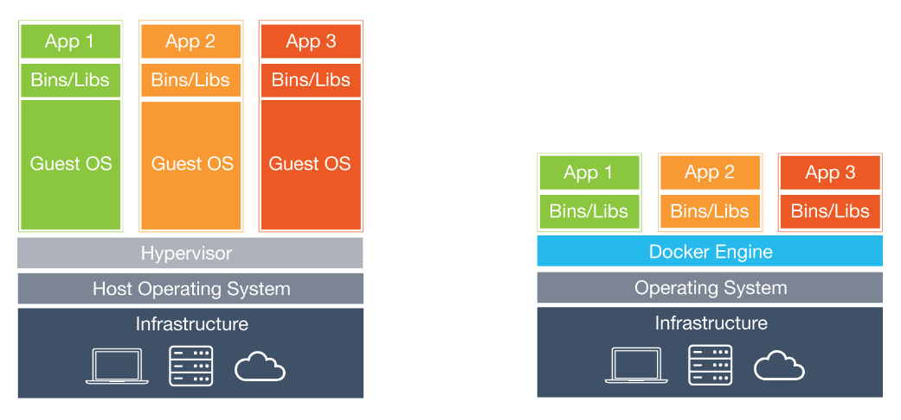

  - IMT Reading Group 
  - Slack Channel

---


## Overview
  
  - What is it good for?
  - What is Docker?
  - "Nice! But how do I use it?!"
  - Basic Architecture
  - Demo


# What is it good for?

---

<!--  -->

  - Reproducibility
  - Portability
  - Scalability


---

  The 4 stages of code isolation:

  1) Separate folder for each project
  2) Using Github or other VCS
  3) python virtual environments (i.e. manipulate `$PATH`)
  4) Virtual Machine

---

  Problems with the above solutions

  - Could impact an other project
  - No guarantee it will work on different machine 
  - ... or tomorrow on the same
  - Slow and huge
  - Difficult to move around


# What is it?

---

Docker is an open source project that:

  - wraps a piece of software
  - in a complete filesystem
  - that contains everything it needs to run (i.e., anything you can install on a server)
  - and **guarantees** it will always **run the same**, regardless of its environment

from https://www.docker.com/what-docker


---

 - Think of `Docker` as a *Ultra Light* Virtual Machine (VM) .
 - It is a tool to create Linux images with **"Known Good State"**.
 - Offers *free* infrastructure to store, distribute and retrieve images
   from anywhere on the web.

---


## Docker Jargon and central concepts


- *docker* *engine* - builds and runs your Docker containers
- *image* - the basis of containers
- *container* - an instance of an image

---

- *docker-compose* - a tool for defining and running multi-container Docker applications
- *docker* *swarm,* *kubernetes,* *mesos,* *...* - orchestration tools that help start containers on appropriate hosts and connect them together.
- *registry* - a repository for images (note Docker provides a hosted "registry" called Docker Hub)

---

  - Image <-> Container
  - OOP: Class <-> Class instance
  - OS: binary <-> Process 
 


---


## Reproducibility

  - Allows to deterministically recreate a machine from scratch
  - Anyone can reproduce your "research" if you publish it's Docker Image and raw data

---


- A machine is completely defined by its `Dockerfile`

```docker
# set base image
FROM ubuntu:14.04

# install what you need
RUN apt-get update && apt-get install -y package-bar
RUN pip install numpy scipy

# default command to execute when starting
CMD bash
```

---

## Portability

  - If a image works as expected on your machine it is **guaranteed** to work on an other
  - Can be easily shared with collaborators (-> all work with the same development environment)
  - If your computer breaks, you start working immediately using any other Machine
    - Assuming you backup your data.

---

## Scalability

  - Start exploring on your local machine
  - You do not have enough RAM/CPU ...
  - Deploy to an Amazon Server or your department's Servers in a few minutes.

---

## Specific Applications

  - Example 1: Run a complex server set up.
    - MySQL
    - Jupyter
    - API keys (e.g. Google Maps)

---

  - Example 2: Graph analysis.
    - Neo4j
    - RStudio
    - PostgreSQL with GIS support (for geographic analysis)
    - `graph_tool` (notoriously difficult to install/build a parallel version)


# Architecture

---



---


---


# Demo

---


## How to install

Installation:

- [general instructions](https://docs.docker.com/engine/installation/)

- [Ubuntu](https://docs.docker.com/engine/installation/linux/ubuntulinux/)

- [OSX](https://docs.docker.com/engine/installation/mac/)


## Test if it works

```bash
docker run hello-world
docker ps
docker ps -a
docker rm quirky_babbage
```

## Dockerfile light

```bash
docker run docker/whalesay
```

---

boring!

  - Customize whalesay image

```bash
docker build -t wisewhale .
```

## Jupyter and RStudio

```bash
docker run -d \
          --name myjupyter \
          -p 8888:8888 \
          --volume $PWD:/home/jovyan/work \
          jupyter/scipy-notebook
```

```bash
docker run -d \ 
      --name myrstudio \
      -p 8787:8787 \
      -v $PWD:/home/rstudio \
      rocker/rstudio
```


## On Amazon Cloud

```bash
ssh -i <keyfile> ubuntu@<aws-ip-address>
# now you are on an ec2 instance
docker run -d \
      --name myjupy \
      -e GEN_CERT=yes \
      -v $PWD:/home/jovyan/work \
      -p 80:8888 \
      verginer/scipy_graph_tool

# to get the security token
docker logs myjupy 
```


## Or just try a new technology

For nearly every micro-service/library/repository there is a `Dockerfile` or `docker-compose.yml`
to get it running in minutes.

---

```bash
docker run \
  -d -p 7474:7474 \
  -v /Users/ryan/panama-papers-data:/data \
  ryguyrg/neo4j-panama-papers
```


# That's it!

---

Some Places to get help/containers and ideas.

  - [How Kaggle uses Containers](http://blog.kaggle.com/2016/02/05/how-to-get-started-with-data-science-in-containers/), they 
  make their images publicly available if you want to use them.
  - [Continuum Analytics](https://www.continuum.io/blog/developer-blog/anaconda-and-docker-better-together-reproducible-data-science)
  Post on why Docker is key to reproducible research.

---

  - [Official Jupyter Docker Stacks](https://github.com/jupyter/docker-stacks), finely tuned base images for nearly all needs.
  - [Domino Labs on Reproducibility](https://blog.dominodatalab.com/data-science-docker/) An account of how large companies use Docker
  to make carry out Data analytics.
  - [Awesome Docker](https://github.com/veggiemonk/awesome-docker), a curated list of useful "Docker" stuff

---

  - [Docker Cheat Sheet](https://github.com/wsargent/docker-cheat-sheet), short overview of commands and how to set it up for
  your system (has 9,000 Github Stars)
  - [Best Practice for Dockerfiles](https://docs.docker.com/engine/userguide/eng-image/dockerfile_best-practices/) a few industry rules to write
  efficient Dockerfiles (i.e. make them easy to read and transparent)
  - [Katakota](https://www.katacoda.com/) Interactive On-line Tutorial, showing the basics

---

  - [Play with Docker](http://play-with-docker.com/) access to a docker machine in the browser to play with, no setup required
  - [Windows Containers](https://docs.microsoft.com/en-us/virtualization/windowscontainers/quick-start/), if you don't like Linux that much
  here is a Windows centric view by Microsoft.
  - Tip use [Cookiecutter Data Science](http://drivendata.github.io/cookiecutter-data-science/) as project structure layout 

--- 


